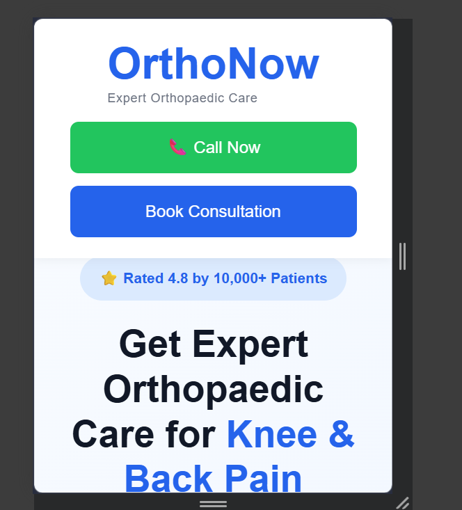
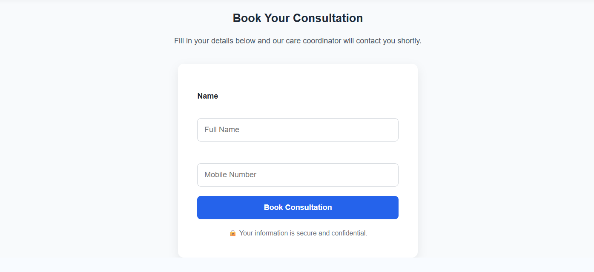
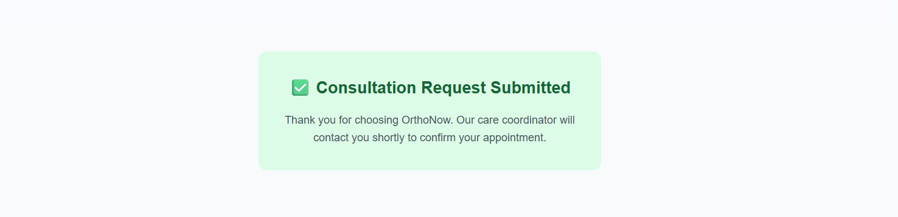

# 🦴 OrthoNow – Healthcare Landing Page with GTM & GA4 Integration

A responsive, conversion-focused healthcare landing page developed for **OrthoNow**, an orthopaedic clinic chain. This project demonstrates how **Google Tag Manager (GTM)** and **Google Analytics 4 (GA4)** can be integrated to track the complete patient consultation journey using custom `window.dataLayer.push()` events.

The project was created as part of a GTM & GA4 implementation assignment with a focus on event tracking, conversion measurement, responsive design, and user experience.

---

# 📖 Project Overview

The objective of this project is to create a modern healthcare landing page that not only provides a seamless appointment booking experience but also captures valuable user interactions for analytics and marketing optimization.

The implementation includes:

- A responsive healthcare landing page
- Consultation booking form
- Custom GTM event tracking
- GA4 integration design
- Conversion funnel tracking
- Mobile-friendly responsive layout

---

# ✨ Features

### 🏥 Landing Page

- Modern Hero Section
- Responsive Navigation
- Benefits Section
- Trust Metrics
- Treatment Process
- Consultation Booking Form
- Frequently Asked Questions (FAQ)
- Professional Footer

---

### 📱 Responsive Design

- Desktop Optimized
- Tablet Friendly
- Mobile Responsive
- Flexible Grid Layout
- Optimized Images

---

### 📊 Analytics Features

- Google Tag Manager Ready
- Google Analytics 4 Event Tracking
- Custom `window.dataLayer.push()` Events
- Funnel Tracking
- Conversion Tracking
- Marketing Attribution Ready

---

# 🛠️ Tech Stack

| Technology | Purpose |
|------------|---------|
| HTML5 | Page Structure |
| CSS3 | Styling & Responsive Design |
| JavaScript | Form Validation & Event Tracking |
| Google Tag Manager | Tag Management |
| Google Analytics 4 | Analytics & Reporting |

---

# 📂 Project Structure

```text
orthonow-landing-page/
│
├── index.html
├── style.css
├── script.js
├── README.md
├── Task-1-GTM-Event-Schema.md
├── integration-design.md
│
├── assets/
│   ├── doctor.jpg
│   └── screenshots/
│       ├── desktop.png
│       ├── mobile.png
│       ├── form.png
│       ├── Thank you.png
│      
│
└── LICENSE
```

---

# 📸 Screenshots

## 🖥️ Desktop View


---

## 📱 Mobile View



---

## 📝 Consultation Form



---

## ✅ Successful Form Submission



---

---

# 📊 Event Tracking

The landing page tracks important user interactions using Google Tag Manager and Google Analytics 4.

| Event Name | Purpose |
|------------|---------|
| booking_step_complete | Tracks booking funnel progress |
| booking_completed | Tracks successful bookings |
| consultation_form_submitted | Tracks consultation requests |
| call_now_click | Tracks phone call button clicks |
| whatsapp_click | Tracks WhatsApp interactions |
| patient_guide_download | Tracks guide downloads |
| clinic_page_view | Tracks clinic page visits |
| blog_scroll_50 | Tracks 50% article scroll |
| blog_scroll_90 | Tracks 90% article scroll |

---

# 🔄 Tracking Workflow

```text
User Interaction
        │
        ▼
Landing Page
(HTML + JavaScript)
        │
        ▼
window.dataLayer.push()
        │
        ▼
Google Tag Manager
        │
        ▼
Google Analytics 4
        │
        ▼
Reports & Funnel Exploration
```

---

# 📈 Booking Funnel

The booking process is tracked using custom GTM events.

```text
Landing Page
      │
      ▼
Booking Started
      │
      ▼
Step 1
(Location & Specialty)
      │
      ▼
Step 2
(Patient Details)
      │
      ▼
Step 3
(Confirmation)
      │
      ▼
Booking Completed
```

This allows marketers to identify where users abandon the booking process and optimize the conversion funnel.

---

# 📁 Assignment Deliverables

## ✅ Task 1 – GTM Event Schema

- Event Schema
- Booking Funnel Events
- dataLayer Events
- GA4 Report Mapping

---

## ✅ Task 2 – Landing Page

- Responsive Design
- Hero Section
- Benefits Section
- Trust Section
- Treatment Process
- Consultation Form
- FAQ
- Footer

---

## ✅ Task 3 – Integration Design

- GTM Architecture
- GA4 Integration
- Google Ads Flow
- Event Mapping
- Tracking Workflow

---

# 💻 How to Run

### Clone the Repository

```bash
git clone https://github.com/your-github-username/orthonow-landing-page.git
```

### Open the Project

```text
Open index.html
```

or launch it using **VS Code Live Server**.

No additional installation is required.

---

# 🧪 Form Validation

The consultation form includes:

- Required field validation
- Phone number validation
- No page reload
- Success confirmation message
- Custom `window.dataLayer.push()` event

Example:

```javascript
window.dataLayer.push({
    event: "consultation_form_submitted",
    patient_name: "Rahul Sharma",
    phone_number: "9876543210",
    source: "Landing Page"
});
```

---

# 🎯 GA4 Reports Supported

- Funnel Exploration
- Conversions Report
- Engagement Report
- Landing Page Analysis
- Audience Building
- User Journey Analysis

---

# 🔮 Future Enhancements

- Online Appointment Calendar
- Doctor Profile Pages
- Payment Gateway Integration
- AI Chat Assistant
- CRM Integration
- Google Maps Clinic Locator
- Email Confirmation Workflow
- Live GTM Container Deployment
- WhatsApp Business API Integration

---

# 👨‍💻 Author

**Harshvardhan Chauhan**

B.Tech Engineering Student

Passionate about Web Development, Analytics, and AI Applications.

- GitHub: https://github.com/your-github-username
- LinkedIn: https://linkedin.com/in/your-linkedin-profile

---

# 📄 License

This project was developed for educational and portfolio purposes as part of a Google Tag Manager & Google Analytics 4 implementation assignment.

---

## ⭐ Acknowledgements

This project demonstrates the implementation of modern web analytics practices using Google Tag Manager (GTM) and Google Analytics 4 (GA4) to build a scalable event-tracking solution for a healthcare consultation booking platform.